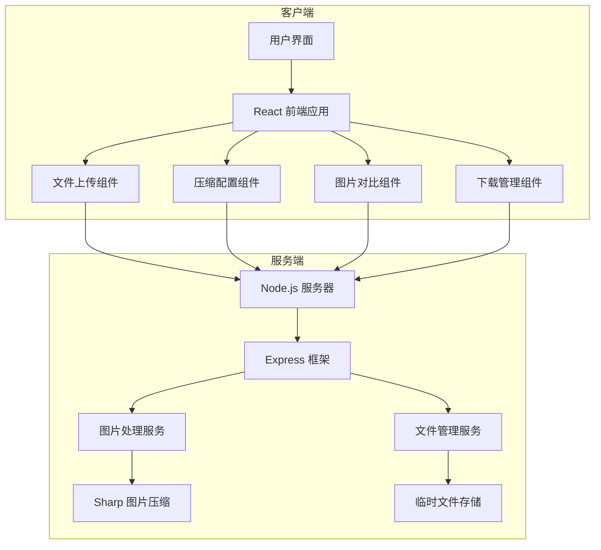
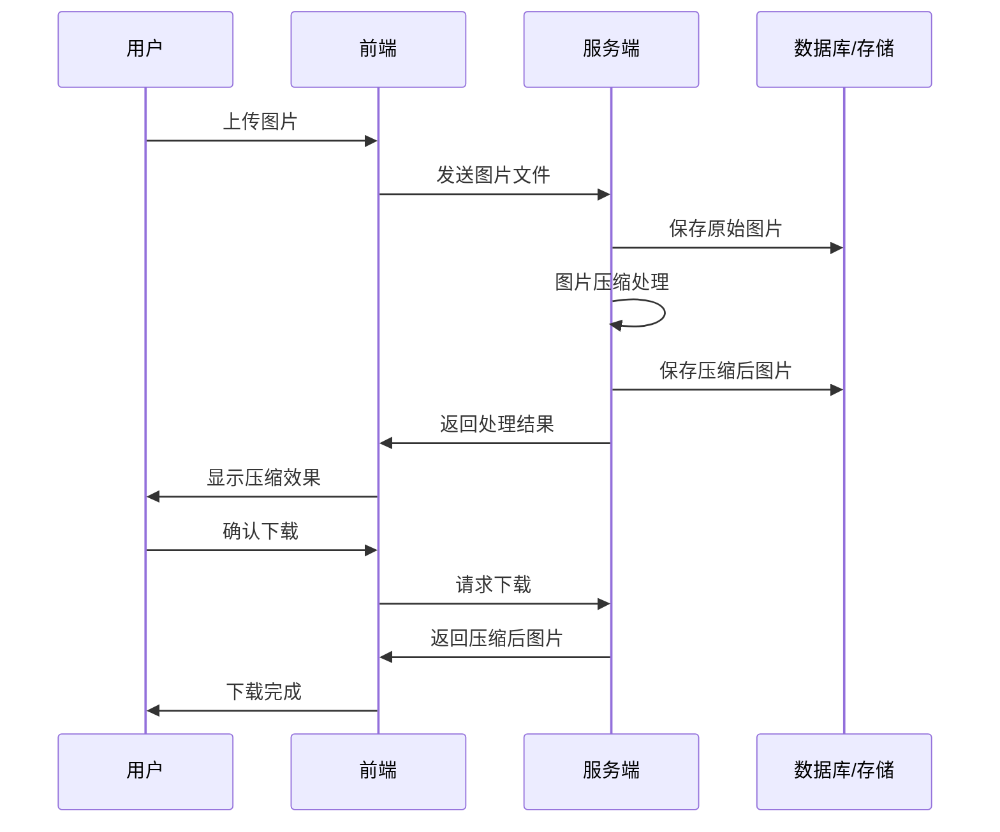
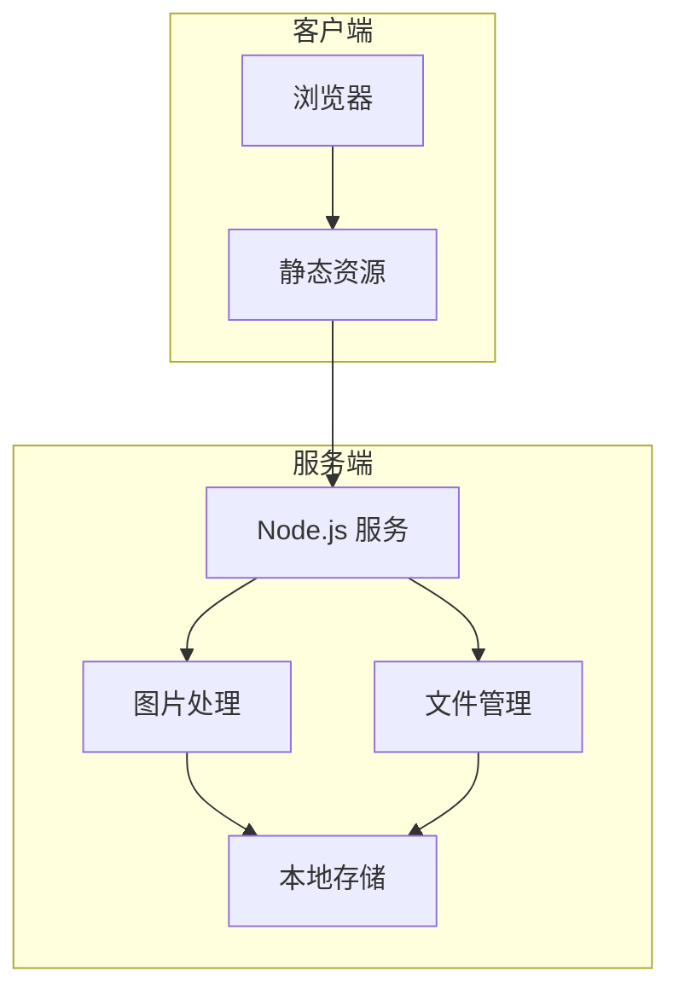
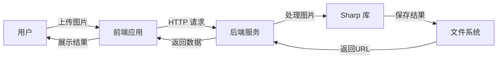

# 技术架构流程图

## 1. 整体架构流程图



## 2. 图片处理流程图



## 3. 系统组件关系图

```mermaid
graph LR
    Markdown Preview Enhancedsubgraph 前端组件
        A[上传组件] --> B[压缩配置]
        B --> C[图片对比]
        C --> D[下载管理]
    end

    subgraph 后端服务
        E[文件上传服务] --> F[图片处理服务]
        F --> G[文件管理服务]
        G --> H[临时存储]
    end

    subgraph 数据流
        I[用户操作] --> J[API 请求]
        J --> K[数据处理]
        K --> L[响应结果]
    end
```

## 4. 部署架构图



## 5. 数据流转图



## 说明

以上流程图展示了系统的主要架构和流程：

1. **整体架构流程图**：展示了客户端和服务端的主要组件及其关系
2. **图片处理流程图**：详细展示了图片从上传到下载的完整流程
3. **系统组件关系图**：展示了各个组件之间的依赖关系
4. **部署架构图**：展示了系统的部署结构
5. **数据流转图**：展示了数据在系统中的流转过程

这些流程图可以帮助开发团队更好地理解系统架构，便于后续的开发和维护工作。
